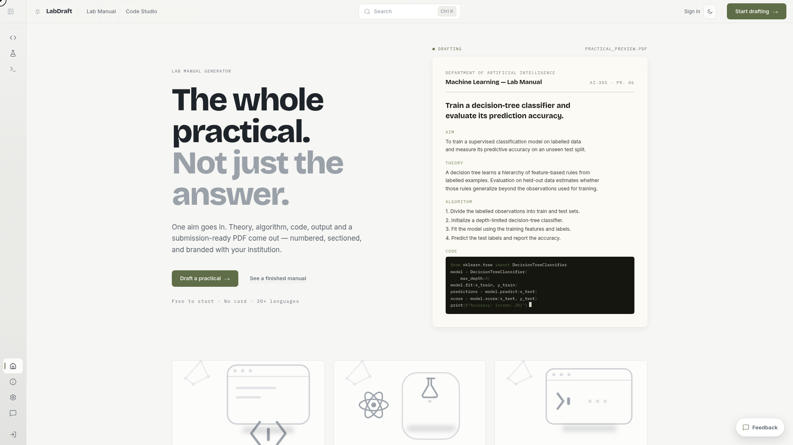
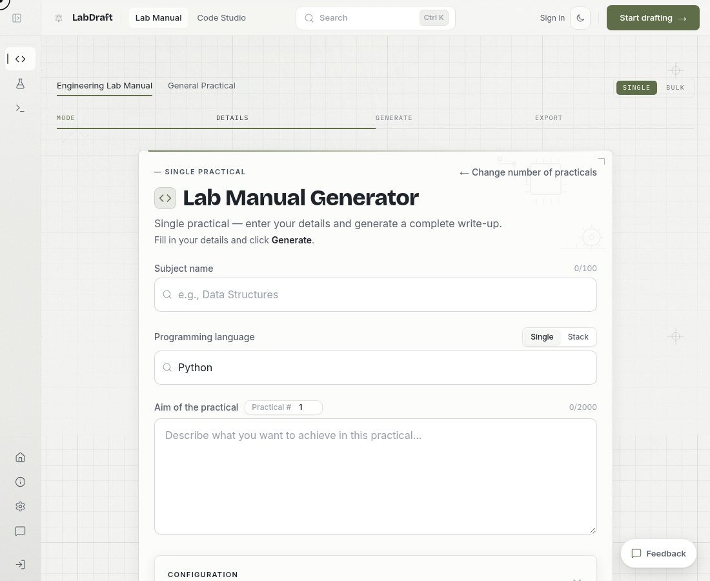
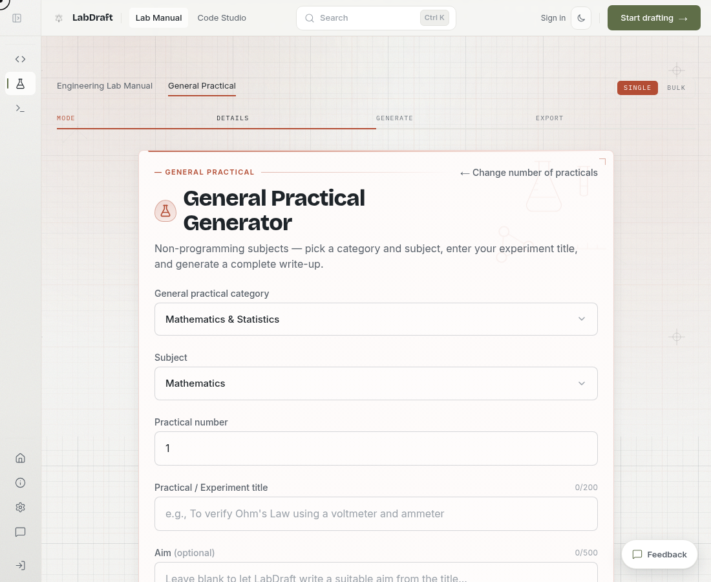
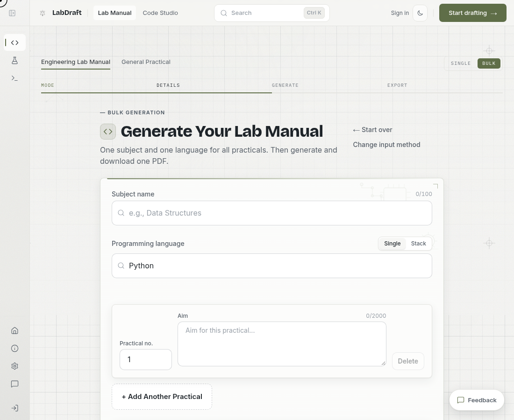
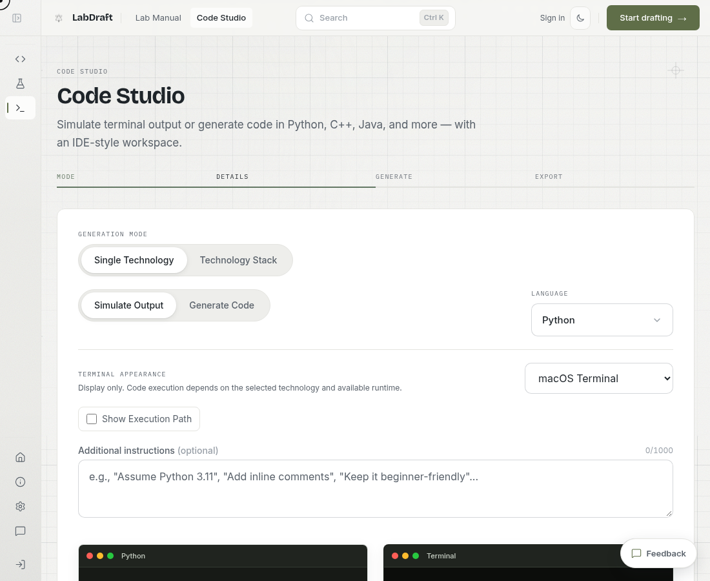
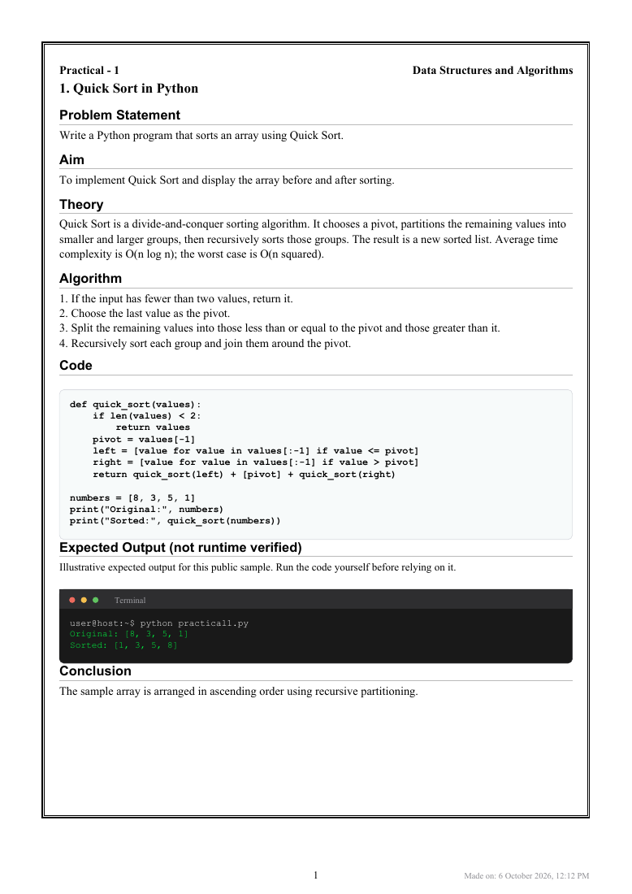

# LabDraft

**From a practical aim to a lab manual you can review, refine, and export.**

LabDraft is a web app for engineering and science students. It helps draft structured practical write-ups, build multi-practical manuals, and work through coding exercises. The live product is at **[labdraft.in](https://labdraft.in)**.

[Try the generator](https://labdraft.in/practical) · [Explore Code Studio](https://labdraft.in/code-studio) · [See how it works](https://labdraft.in/about) · [Star this showcase](https://github.com/KaizunLabs/LabDraft-showcase)

> **About this repository:** This is the public product showcase. LabDraft's production source code, prompts, database, and infrastructure are private. The images below show the product; they are not a downloadable implementation or a promise that generated content needs no review.

## What you can do

| Workflow | What it is for |
| --- | --- |
| [Engineering Lab Manual](https://labdraft.in/practical?type=programming&mode=single) | Draft a coding practical from its subject and aim. Choose the sections and language you need, then review the generated theory, algorithm, code, and output. |
| [General Practical](https://labdraft.in/practical?type=general&mode=single) | Draft non-programming experiments with discipline-appropriate procedures, observations, results, tables, and diagrams. |
| [Bulk manuals](https://labdraft.in/practical?type=programming&mode=multiple) | Enter a series of aims, paste a list, or upload a syllabus. Generate a numbered manual and review each practical before exporting. |
| [Code Studio](https://labdraft.in/code-studio) | Generate code or explore its output in an editor and terminal-style workspace. The app labels predicted output separately from output verified by an available execution runtime. |
| [Saved Library](https://labdraft.in/dashboard/practicals) | With an account, explicitly save finished practicals, find them later, mark favourites, and view revisions. Generation and download do not save automatically. |

## How it works

1. **Choose a lab type and scope.** Start with one practical or a full manual.
2. **Describe the work.** Enter a subject and aim, or provide a list or syllabus for bulk drafting.
3. **Choose the output.** Select relevant sections, language, and document options.
4. **Generate and review.** Check the content, code, diagrams, observations, and any output verification label. Bulk runs keep failed items visible so they can be retried or completed manually.
5. **Export or save.** Download a PDF or Word document with optional institution details. Signed-in users can save a completed practical to their private Library.

AI-generated material can be wrong or incomplete. Review it against your course requirements and verify code, results, figures, and certificate details before using it.

## Product tour

### Engineering practicals

The single-practical form starts with a subject, programming language, and aim. Additional settings let you tailor the generated sections and execution inputs.

### Science and other general practicals

The General Practical path uses a category, subject, experiment title, and optional aim for non-programming work.

### A whole manual in one workflow

Bulk mode keeps practical numbers and aims together. You can add items one by one, paste them, or upload a supported syllabus file. The export retains the order of requested practicals, including clearly marked slots that need attention.

### Code Studio

Code Studio offers code generation and output simulation across languages and technology stacks. Its terminal appearance is a display choice; it does not imply that a particular operating system or tool executed the code.

### A finished document

This one-page Quick Sort example shows the PDF layout: structured sections, code, a terminal-style output panel, and a clear verification label. It is a deterministic sample made with LabDraft's current PDF exporter, **not an AI-generated result or a student's submission**. [Download the sample PDF](samples/quick-sort-practical.pdf).

*App screenshots were captured from the public site on 6 October 2026 in a signed-out browser. The homepage document is an illustrative preview; the workstation images show starting forms. The separate PDF example was produced from fictional sample content. The interface may change after this snapshot.*

## Behind the product

LabDraft combines a guided browser interface, server-side generation services, structured result checks, document export, and optional authenticated storage. The public [architecture overview](ARCHITECTURE.md) explains these responsibilities and trust boundaries without publishing production implementation details.

LabDraft is made by **Kaizun Labs**. Visit [labdraft.in](https://labdraft.in) to use the product or read the [product walkthrough](https://labdraft.in/about). For changes to the live product, see its [changelog](https://labdraft.in/changelog).

## Public repository and feedback

This repository is for people who want to understand and follow LabDraft. **Starring this repository supports the product showcase; it does not provide access to the private application source.**

- For product ideas or questions, use the [LabDraft feedback page](https://labdraft.in/feedback).
- To report a security issue privately, follow [SECURITY.md](SECURITY.md).
- For ownership and reuse terms, read [NOTICE.md](NOTICE.md).

© 2026 Kaizun Labs. All rights reserved.
